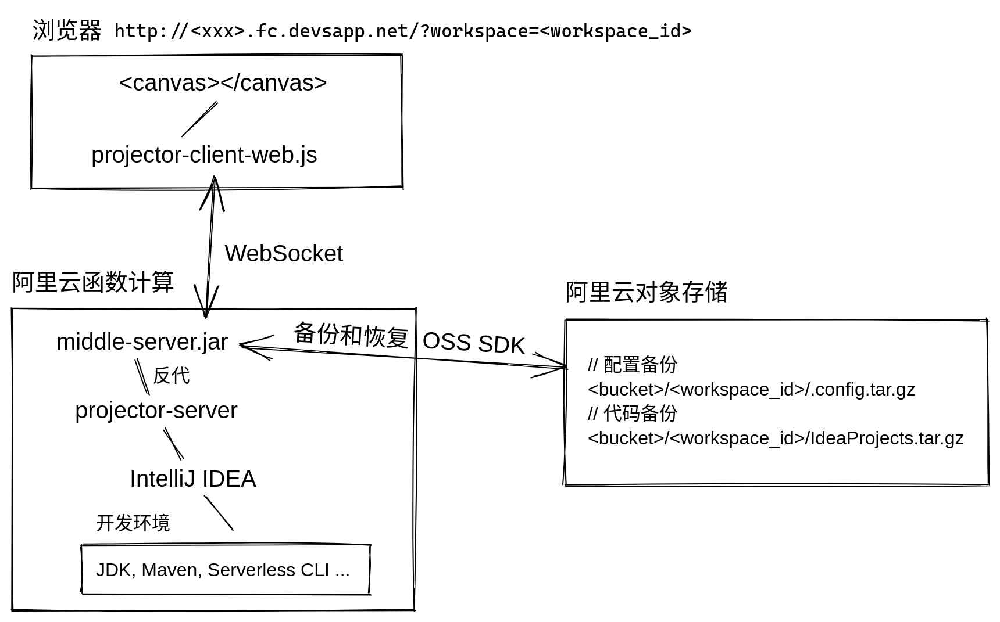

# IntelliJ IDEA on web, but serverless

[](https://www.serverless-devs.com)
[](https://www.devsapp.cn/details.html?name=idea-webide)
[](https://www.devsapp.cn/details.html?name=idea-webide)

## 应用背景

在云的时代，我们已经能够轻松地在阿里云函数计算上，部署一个在线版 VSCode。然而 VSCode 的后端开发体验仍然不如 IntelliJ IDE。虽然市面上已经出现了 [Eclipse Che](https://www.eclipse.org/che/)、[云效云端开发平台 DevStudio](https://www.aliyun.com/product/yunxiao/devstudio) 等支持 IntelliJ 的在线开发平台，但是部署复杂、不够轻量。由此引发思考：能不能把 IntelliJ IDE 也搬上 Serverless？享受 Serverless 即搭即用、按量付费的特性呢？

## 技术架构实现、原理以及亮点



我是如何使用阿里云的一个或者多个 Serverless 服务实现 Web IDE 服务？

1. 通过 [projector-server](https://github.com/JetBrains/projector-server) 将 IDE 封装为远程服务。
1. IDE 解压后有近 2 GB 的大小，可将 IDE 的依赖（`jbr`、`lib`、`plugins`）拆到各自的函数层（`layer`）中，以降低单次部署需要上传的包大小。
1. 编写 Java 程序实现配置同步、代码同步，同步源可选阿里云 OSS。

相比官方给的默认示例，我有什么亮点？

1. 不重复造轮子！截至 2022 年 7 月 14 日，[Google 搜索](https://www.google.com/search?q=deploy+intellij+to+serverless) 中还未出现成功将 Intellij IDE 部署到 Serverless 函数计算的实践案例。
1. IDEA 的 Java 开发体验更好，默认示例使用的 VSCode 难以胜任 Java 等语言开发场景。
1. 集成 Serverless Devs CLI 等常用 FC 开发工具，支持快速开发和测试 FC Java runtime 函数。
1. 配置同步、代码同步。
    > 我们实现了一个中间件管理浏览器与 Projector Server 之间的连接，用户通过 WebSocket 协议连接中间件，中间件将请求转发给 Projector，中间件可以监控连接，当连接断开时，会触发配置同步、代码同步，此外，每分钟也会定时自动同步，同步过程为打包（tgz）并上传到阿里云 OSS。此外，我们考虑到用户可能需要维护多个项目，所以开发了 workspace，当用户第一次访问时，会自动创建一个 workspace，可以在地址栏看到 workspace id，每个 workspace 都会同步到 OSS 中的一个独立的目录，当用户关闭并重新打开时，会根据地址中的 workspace id 恢复相应的配置和代码，以此来实现多项目管理。
1. 多租安全隔离。
    > 在 IDEA 中实现多租隔离非常困难，即使前面我们已经为不同的用户分配了不同的 workspace，也无法阻止用户通过 IDE 中的 "Open Folder"、"Terminal" 功能访问其他租户的文件。好在阿里云函数计算的实例是天然支持安全隔离的，当 `instanceConcurrency` 设为 1 时，一个运行实例只接收一个连接，多个用户访问时，会自动启动新的实例，就不会冲突了。

接下来还要继续实现什么功能？

1. TODO: 首屏加载时间过长。受限于 projector 的启动时间长，可以在 projector 启动过程时先返回一个静态 loading 页，页面风格可以参考云效和 GitHub Codespaces，每秒调 status API 询问启动状态，当启动状态为 true 时，再发起真正的 websocket 连接。

## 使用说明

~~您可以体验 [demo 站点](http://idea-fc.idea-server.1064348262863466.cn-hangzhou.fc.devsapp.net/)~~ _额度已经耗尽了，demo 站点已删除_，也可以一键部署到自己的阿里云账号。

### 一键部署

[](https://fcnext.console.aliyun.com/applications/create?template=idea-webide)

部署类型请选择“直接部署”，不要选择“通过代码仓库部署”，否则部署不成功。

### 通过 [Cli](https://www.serverless-devs.com/serverless-devs/install) 部署

需 Linux 环境，需安装 Node.js，按照 Cli 提示一步步操作。

```sh
npm i -g @serverless-devs/s
s init idea-webide
cd idea-webide
s deploy
```

### 视频演示

为了防止因无法使用影响评测，下面我提供了视频演示。<br>
[bilibili.com/video/BV1md4y1P7ZA](https://www.bilibili.com/video/BV1md4y1P7ZA)

## 实现说明

1. 该应用部署在阿里云帐号 1064348262863466 下，杭州区域。
1. 该应用主要使用了阿里云如下服务：
    * 函数计算服务，服务名包括 `idea-server`。
    * OSS服务，bucket名称是 `imaegoo`。
1. 该应用的实现代码在当前项目下。

## 参考资料

### 小白学习路径

1. [函数计算官网](https://help.aliyun.com/document_detail/52895.html) 
1. [使用 Serverless-Devs 工具快速开发 FC cookbook](https://docs.serverless-devs.com/fc-faq/s_fc_cookbook/readme)

### 官方参考 DEMO

[https://github.com/devsapp/start-serverless-webide](https://github.com/devsapp/start-serverless-webide)
